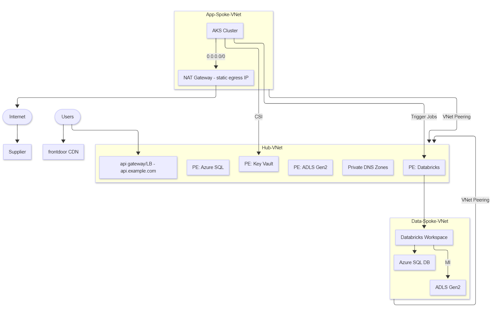

# Phase 1 – Architecture & Design Runbook

## 🎯 Objective
Design a secure Sandbox environment on Azure using a **hub-and-spoke topology** to isolate workloads, protect sensitive data, and ensure controlled connectivity between application and data layers.

This phase delivers the **architecture blueprint**: network topology, resource boundaries, traffic flows, identity model, and secret management strategy. It sets the foundation for Terraform IaC in Phase 2.

---

## 1) Architecture Overview

- **Hub VNet** – Shared services: hosts Private Endpoints for PaaS resources, Private DNS Zones, and optional Bastion/Firewall.
- **App Spoke VNet** – Application workloads: Azure Kubernetes Service (AKS) and Key Vault. Includes a **NAT Gateway** for outbound internet traffic (e.g., supplier API calls).
- **Data Spoke VNet** – Data workloads: Databricks Workspace, Azure Data Lake Storage (ADLS Gen2), Azure SQL Database.

**Connectivity Principles**
- Spokes never talk directly. All traffic to PaaS resources flows **through Hub Private Endpoints**.
- AKS uses **Private Link via Hub** to reach Key Vault and Databricks.
- Databricks connects privately to ADLS and SQL.
- App Spoke requires **controlled outbound internet** for supplier API calls → solved with **NAT Gateway**.

---

## 2) Components and Responsibilities

### 2.1 Hub VNet
- **Purpose:** Central connectivity plane for isolation and governance.
- **Components:**
  - **Private Endpoints:** For Key Vault, ADLS, SQL, Databricks.
  - **Private DNS Zones:** Ensure spoke workloads resolve service FQDNs to private IPs.
  - **Optional:** Bastion host (jumpbox), Azure Firewall (not used for egress in this design).
- **Security:** Spokes can resolve and connect to services only via hub PEs. No lateral spoke-to-spoke traffic.

### 2.2 App Spoke VNet (Applications)
- **Purpose:** Host containerized applications (AKS).
- **Components:**
  - **AKS Cluster:** Runs sample APIs, batch jobs, UI components.
  - **Azure Key Vault:** Secrets store, mounted into pods via CSI driver.
  - **NAT Gateway:** Provides static outbound IP(s) for internet egress.
- **Security:** Outbound restricted to HTTPS (443). Suppliers can allowlist the NAT GW IP.

### 2.3 Data Spoke VNet (Data & Analytics)
- **Purpose:** Isolate sensitive data and analytics workloads.
- **Components:**
  - **Databricks Workspace:** Private Link-enabled.
  - **ADLS Gen2:** Primary data lake with Blob/DFS private endpoints.
  - **Azure SQL Database:** Data persistence, with private endpoint access.
- **Security:** Accessible only via hub private endpoints; no public exposure.

### 2.4 Identity Model
- **Managed Identities (MSI):**
  - AKS workloads authenticate to Key Vault and Databricks securely without secrets.
  - Databricks uses its MSI for ADLS/SQL access.
- **Federated Identity (OIDC):**
  - GitHub Actions → Azure Service Principal (Phase 0) for Terraform automation.

### 2.5 Secret Management
- **Azure Key Vault:** Single source of truth for secrets.
  - AKS: uses CSI driver to inject secrets into pods.
  - Databricks: can consume Key Vault-backed secret scopes.
- **No hardcoded secrets** in code or pipelines.

---

## 3) Why NAT Gateway?
Outbound internet egress from AKS is required to reach external supplier APIs. Two options were evaluated:

- **Option A: NAT Gateway (Chosen)**
  - Simple, cost-effective, scales automatically.
  - Provides **static public IP(s)** for allowlisting by suppliers.
  - Minimal configuration (no custom UDRs needed).
- **Option B: Azure Firewall**
  - Advanced egress control (FQDN filtering, TLS inspection).
  - Higher cost and operational complexity.

**Decision:** NAT Gateway strikes the right balance for a Sandbox POC: low-cost, predictable outbound IPs, sufficient for supplier integrations.

---

## 4) Traffic Flow Summary

1. **AKS → Key Vault**  
   Uses CSI driver, resolves FQDN via hub Private DNS → Private Endpoint in Hub.
2. **AKS → Databricks**  
   Calls Databricks workspace via Private Endpoint in Hub.
3. **Databricks → ADLS/SQL**  
   Accessed via Managed Identity through Hub Private Endpoints.
4. **AKS → Supplier APIs (Internet)**  
   Routed via NAT Gateway (static public IP).

---

## 5) Risks and Mitigations

- **SNAT Port Exhaustion (NAT GW):** Use IP Prefix or multiple IPs if outbound demand is high.  
- **Misconfigured DNS:** Ensure Private DNS zones linked to all VNets.  
- **Over‑permissive IAM:** Limit RBAC at resource group level, not subscription.  
- **Databricks Private Link dependencies:** Verify region support and required subresources.

---

## ✅ Outcome
The Phase 1 architecture ensures:
- **Isolation:** Hub–spoke topology prevents lateral access.  
- **Security:** All PaaS access via Private Links; secrets centralized in Key Vault.  
- **Scalability:** Modular design supports future extension (e.g., Firewall, VPN/ER).  
- **Compliance:** Predictable IP egress via NAT Gateway for supplier allowlisting.  

This blueprint now informs **Terraform modules in Phase 2**.
