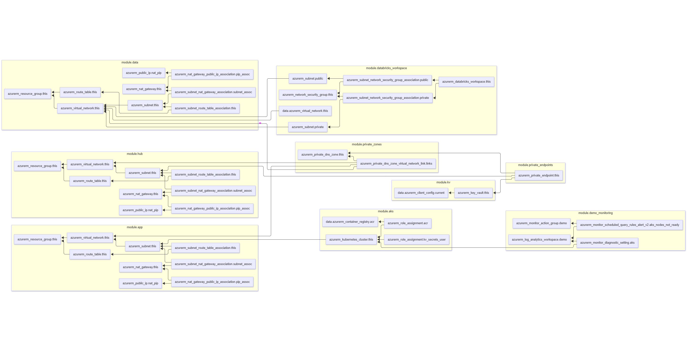

# Azure Infrastructure Assessment (Terraform)

This directory contains Terraform modules for provisioning Azure resources as part of the Azure Infrastructure Assessment (AIA) project.

## Modules

### `aks`

Provisions an Azure Kubernetes Service (AKS) cluster with a system-assigned managed identity, and grants the necessary permissions to access an Azure Container Registry (ACR) and Azure Key Vault (KV).

### `app`

Provisions an Azure Virtual Network (VNet) with a single subnet, and creates a Network Security Group (NSG) with some basic rules.

### `data`

Provisions an Azure Virtual Network (VNet) with a single subnet, and creates a Network Security Group (NSG) with some basic rules.

### `databricks`

Provisions an Azure Databricks workspace with a system-assigned managed identity, and grants the necessary permissions to access an Azure Key Vault (KV) and Azure Storage.

### `hostedzone`

Provisions an Azure Private DNS Zone and links it to multiple Virtual Networks (VNets).

### `keyvault`

Provisions an Azure Key Vault with a system-assigned managed identity, and grants the necessary permissions to access an Azure Virtual Machine (VM) and Azure Kubernetes Service (AKS).

### `private-endpoints`

Provisions Azure Private Endpoints for various Azure services (e.g. Azure Key Vault, Azure Storage, Azure Databricks).

### `vnet`

Provisions an Azure Virtual Network (VNet) with multiple subnets, and creates a Network Security Group (NSG) with some basic rules.
